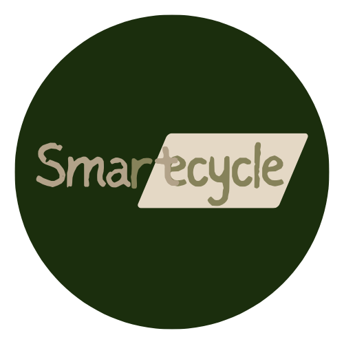

# **Smartcycle: Unlocking a Greener Future! 🌿**

Welcome to Smartcycle, where recycling meets gamification! Our mission? To turn eco-consciousness into a thrilling adventure. Let’s dive into the details:

* 🌟 Earn Points, Save the Planet:
  * Every bottle, can, or cardboard box you recycle earns you EcoPoints. The more you recycle, the higher you climb on our leaderboard!
  * Compete with Friends: Challenge your buddies to see who can collect the most points. Bragging rights included!

* 🌎 How It Works:
  * Scan & Score: Simply upload a picture of recyclable items. 
  * Our model will analyze and output: what the type of the waste is, the nearest recycling center to recycle it and innovative ways for you to recycle it at home.

Your job: Recycle it and boom! Instant points.
  * Track Your Progress: Check your personalized dashboard. See how many plastic bottles you’ve saved from landfills.
  * Leaderboards: Are you a recycling superstar? Climb the ranks and inspire others to follow suit.
* 🏆 Top Recyclers Get Rewarded:
  * Monthly Prizes: Win eco-friendly goodies like reusable water bottles, bamboo toothbrushes, or solar-powered chargers.
  * Community Impact: Smartcycle supports local initiatives. The more you recycle, the bigger our collective impact.
* 🌍 Join the Movement:
  * Ready to level up your recycling game? Check out the website now and let’s make our planet a cleaner, greener place! 🌎♻️

Remember, every bottle counts! 🌱

## Inspiration

Our journey with Smartcycle began fueled by a shared passion for sustainability. We looked around and saw the mounting environmental challenges: plastic pollution, overflowing landfills, and climate change. It hit us — we needed to act, not just as individuals, but as a collective force. That’s when the idea of gamification struck. What if we rewarded people for their recycling efforts? What if we transformed mundane actions into thrilling challenges? Smartcycle was born—a fusion of technology, environmental consciousness, and a dash of competitive spirit. We envisioned an app that would gamify recycling, making it as addictive as leveling up in a game. As we continue to refine and expand Smartcycle, we’re driven by a singular purpose: to leave a greener legacy for generations to come.

## What it does

Our system analyzes uploaded pictures to identify recyclable items—whether it’s a plastic bottle, aluminum can, or cardboard packaging. We’re continually refining our image recognition algorithms to accurately classify recyclables. Based on the recognized items, users earn EcoPoints, turning each photo into a mini recycling victory. We also provide recycling tips: for instance, older printed photos coated with silver cannot be recycled due to the chemicals involved, but digital photos printed on non-toxic ink are recyclable. Need to dispose of specific items? Our app guides you to nearby recycling centers, helping you make eco-friendly choices. Join our community, share your recycling journey, and together, let’s create a greener world—one uploaded photo at a time!

## How we built it

Our journey began with the frontend—a user-friendly interface built using HTML. We wanted it to be intuitive, allowing users to upload photos effortlessly. On the backend, we harnessed the power of Python. But not just any Python—we leveraged TensorFlow and Keras for image recognition. These machine learning libraries enabled us to analyze uploaded photos, identify recyclable items, and allocate EcoPoints accordingly.

But that’s not all. To weave everything together seamlessly, we turned to Django. This robust web framework handled user authentication, data processing, and communication with the frontend. And speaking of authentication, we integrated Auth0—a secure identity management platform. It ensured that our users’ interactions with Smartcycle remained private and protected.

And where did we store our code? GitHub became our digital workshop—a collaborative space where we committed, branched, and merged our efforts. The version control system kept our development organized and allowed us to iterate rapidly.

We also edited our code in TinyMCE and ran our model using Google's Cloud Computing to streamline our development process.

In summary, Smartcycle is a harmonious blend of HTML, Python, machine learning, Django, and Auth0—all orchestrated through GitHub. Together, they empower users to recycle smarter and make a tangible impact on our planet.

## Challenges we ran into

Developing Smartcycle presented us with a series of challenges. First, training the image recognition model was resource-intensive due to hardware limitations. We optimized our model parameters to work within these constraints. Next, integrating the model with the backend was crucial. Ensuring seamless data flow from user-uploaded photos to processing pipelines required careful alignment. Finally, setting up and deploying the server posed its own hurdles. Debugging errors and ensuring stability were top priorities. Wanting to ensure user security as well, we had to integrate with auth0. On top of that, we had some issues with our version control on GitHub. Despite these challenges, we were able to perservere.

## Accomplishments that we're proud of

1. Build an aesthetic website with a harmonious combination of colors
2. Successfully train the model to classify different kinds of trash from user's input images with an accuracy of 80% within 5 hours
3. Created file transfer of image binary data over the web from client to server

## What we learned

1. Learn and apply django framework built on python for back end web development
2. Learn and apply animation in css
3. Learn and apply Python supervised machine learning for object classification

## What's next for SmartCycle

Several features that could be improved:
If successfully pitched, we would like to develop more on the following aspects:

* Generate more innovative recycling methods for each kind of waste
* Collaborate with recycling centers to better promote the practice of sustainable living and recycling
* Improve our machine learning model to be able to classify a wider range of waste products

## Credits

* Authors
  * **David Shen** - [Github](https://github.com/SnazzyBeatle115)
  * **Sewon Kim** - [Github](https://github.com/SewonKim0)
  * **Kathy Tran** - [Github](https://github.com/kathytran88)
  * **Alex Jia** - [Github](https://github.com/yaojiejia)

* Garbage Classification Model: <https://www.kaggle.com/datasets/asdasdasasdas/garbage-classification>
